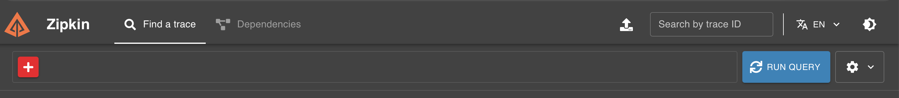
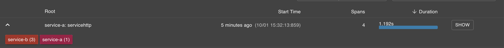
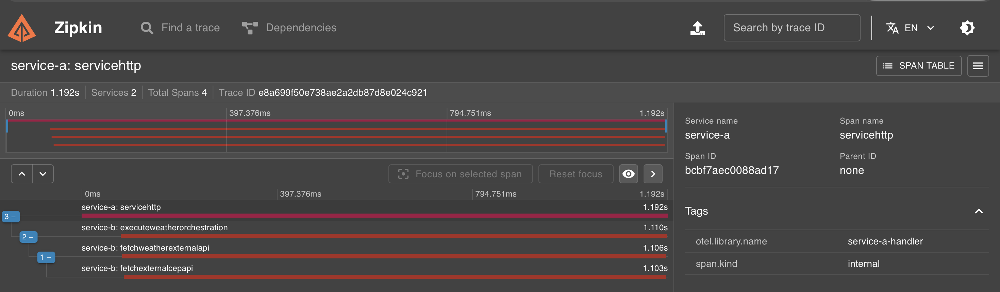

# Desafio: Clima por CEP com Observabilidade

Sistema distribuído em Go com OpenTelemetry e Zipkin — Go Expert

# Objetivo

Desenvolver um sistema distribuído em Go composto por dois microsserviços (Serviço A e Serviço B) que cooperam para consultar o clima de uma cidade baseada no CEP. O diferencial deste desafio é a implementação de Observabilidade utilizando OpenTelemetry (OTEL) e Zipkin para realizar o rastreamento distribuído (Distributed Tracing) das requisições.

# Setup

O projeto é executável via Docker Compose, ele será responsável por subir o servidor-A, servidor-B, otel-colector e zipkin, então esse containers subirão nas seguintes configurações:
|recurso|nome do container|número da porta|dependência|
|-----|------|-------|-------|
|zipkin|zipkin|9411:9411||
|otel-collector|otel-collector|4317:4317|zipkin|
|servidor B|service-b|8082:8082|otel-collector|
|servidor A|service-a|8080:8080|service-b|

### Docker
Para subir os containers no Docker use o comando.

```shell
docker-compose up -d --build
```

Obs: É comum algumas portas estarem sendo usadas e isso faz com que o comando acima falhe, então derrube todas as portas com o comando abaixo e em seguida rode o primeiro comando novamente.

```shell
docker-compose down 
```

Agora todos os serviços devem estar funcionando, para verificar o status dos containers use.

```shell
docker compose ps
```

### API request
Na pasta raíz do projeto tem uma pasta chamada `/api` dentro dela tem um arquivo chamado `weather_api.http`com a requisição `POST`, será necessário apenas trocar o CEP e apertar o botão "request". Caso não tenha a extensão instalada também é possível realizar o request via terminal, usando o curl abaixo

```curl
curl -X POST http://localhost:8080/weather/cep \
  -H "Content-Type: application/json" \
  -d '{"cep": "29902555"}'

```

> Atenção: O modelo acima é o único modelo válido, caso o cep seja no formato "29902-555" ou diferente de string, a chamada irá falhar

### Observability
O projeto está sendo observado de ponta à ponta, assim que uma requisição for feita serão disparados os eventos de track via o collector do open telematry. Para olhar o que os registros desses eventos será o usado o zipkin.

1. Abra a url localhost na porta especifica do zipink em seu navegador
```text
http://localhost:9411/zipkin/
```
2. Aperte o botão `RUN QUERY` (lado superior direito)
<p align="left">
  
</p>
3. Será exibido o resultado, clique na setinha para baixo ou em `Expand All`
<p align="left">
  
</p>
4. Irá aparecer o nome de início do fluxo, quando iniciou, a quantidade de spans e a duração
 É possível clicar nos botões com os nomes dos servidores para adiciona-los como filtros, mas para ver o fluxo completo clique em show
<p align="left">
  
</p>
5. Então a tela de detalhes sera exibida.
<p align="left">
  
</p>

Nessa tela é possível visualizar o tempo total da requisição no exemplo da última imagem o tempo total foi de 1.192s, no gráfico mostra o tempo de partida `0ms` e o tempo total `1.192s`. 
Logo abaixo é possível ver o quanto demorou cada serviço e o tempo total, no caso do serviço b por ter mais orquestrações ele está exibindo mais detalhado.
Então temos o seguinte resultado
|detalhe|tempo|
|-----|-----|
| metodo execute | 1.110s |
| metodo feth(weater) | 1.106s |
| metodo feth(cep) | 1.103s |

#### 🗺️ Arquitetura do Fluxo Completo:

* 📥 **Usuário:** Dispara um `POST /weather/cep` enviando o JSON com o CEP.
* 📦 **Serviço A (Validador e Proxy):**
  * Intercepta a requisição e inicia o Trace ID original.
  * Valida o formato do CEP. Se for inválido, rejeita imediatamente com HTTP `422`.
  * Se o CEP for válido, propaga o contexto de tracing via cabeçalhos HTTP (W3C) e despacha a requisição para o Serviço B.
* ⚙️ **Serviço B (Orquestrador e Domínio):**
  * Extrai os cabeçalhos de tracing, garantindo a continuidade do rastro no mesmo gráfico.
  * Executa a requisição externa à API de Localização para traduzir o CEP em Cidade (**Span Manual**).
  * Executa a requisição externa à API de Clima para obter a temperatura da cidade em tempo real (**Span Manual**).
  * Realiza os cálculos de conversão de temperatura (Celsius, Fahrenheit e Kelvin).
  * Devolve os dados estruturados em um DTO de saída para o Serviço A.
* 📤 **Serviço A:** Intercepta a resposta de sucesso e devolve o JSON final purificado para o usuário.

> **💡 Análise Arquitetural:** 
> Avaliando a árvore temporal do gráfico, o processamento total do **Serviço B** consumiu **1.110s** do fluxo. Isso nos indica de forma matemática e visual que o custo computacional do **Serviço A** foi de apenas **82ms** (atividades de validação de regex, proxies de rede, injeção de cabeçalhos e serialização/deserialização de JSON).
> 

# Arquitetura do sistema

O sistema é composto por:

**Serviço A (Input)**: Recebe a requisição do usuário, valida o CEP e encaminha para o Serviço B.
**Serviço B (Orquestração)**: Recebe o CEP, identifica a cidade, consulta a temperatura e realiza as conversões.
OTEL + Zipkin: Infraestrutura de coleta e visualização dos traços.

# Requisitos técnicos: Serviço A (Input)

Este serviço é a porta de entrada. Ele deve ser exposto via HTTP e comunicar-se com o Serviço B.
Endpoint: Deve aceitar requisições via POST.
Payload de entrada: O corpo da requisição deve seguir o formato JSON:
```json
{
  "cep": "29902555"
}
```

# Validação:

- [x] O CEP deve ser recebido como String.
- [x] O CEP deve conter exatamente 8 dígitos.

# Comportamento:

**Válido:** Encaminha a requisição para o Serviço B via HTTP.
**Inválido:** Se o CEP não tiver 8 dígitos ou não for string, retornar:
- Código HTTP: 422
- Mensagem: invalid zipcode

# Requisitos técnicos: Serviço B (Orquestração)

Este serviço é responsável pela lógica de negócio.
Entrada: Recebe um CEP válido de 8 dígitos (enviado pelo Serviço A).
Localização: Consulta uma API externa (como ViaCEP) para obter o nome da cidade.
Clima: Consulta uma API externa (como WeatherAPI) para obter a temperatura atual da cidade.
Conversão: Retorna a temperatura formatada em Celsius, Fahrenheit e Kelvin.
Respostas (Output):
Sucesso — 200 OK
Deve retornar a cidade e as temperaturas formatadas:
```json
{
  "city": "São Paulo",
  "temp_C": 28.5,
  "temp_F": 83.3,
  "temp_K": 301.65
}
```

# Erros

Status	Mensagem	Quando ocorre
- [x] 422	invalid zipcode	CEP com formato inválido
- [x] 404	can not find zipcode	CEP com formato correto, mas não encontrado

# Requisitos de observabilidade (OTEL + Zipkin)

- [x] Você deve instrumentar ambos os serviços para garantir o rastreamento completo da requisição.
- [x] Tracing distribuído: Implemente o tracing de forma que seja possível visualizar no Zipkin o fluxo completo:
Request → Serviço A → Serviço B
- [x] Spans específicos: Além do tracing automático das requisições web, você deve criar Spans manuais para medir o tempo de resposta de:
- [x] Busca de CEP (API externa de localização).
- [x] Busca de temperatura (API externa de clima). 
- [x] Infraestrutura: Utilize um OTEL Collector para receber os dados dos serviços e enviá-los ao Zipkin.

# Dicas e fórmulas

APIs sugeridas
ViaCEP — localização
WeatherAPI — clima
Fórmulas de conversão
Celsius para Fahrenheit: F = C × 1.8 + 32
Celsius para Kelvin: K = C + 273
Infraestrutura e entrega

# Requisitos de Docker

O projeto deve ser totalmente executável via Docker Compose. O arquivo docker-compose.yaml deve subir:
- [x] Serviço A
- [x] Serviço B
- [x] OTEL Collector
- [x] Zipkin

# Entregável

- [x] Código fonte: Repositório contendo a implementação dos serviços A e B.
- [x] Docker Compose: Arquivo configurado para rodar todo o ecossistema.
Documentação (README):
- [x] Instruções de como realizar a requisição POST no Serviço A.
- [x] Instruções de como acessar o Zipkin para visualizar os traços.

**Regras de entrega**

- [x] Repositório exclusivo: O repositório deve conter apenas o projeto em questão.
- [x] Branch principal: Todo o código deve estar na branch main.
